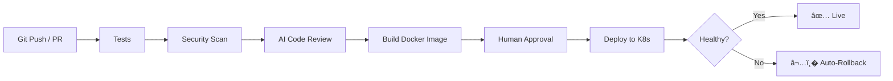

# Project 1 — AI-Powered CI/CD Pipeline (Explained)

## 🎯 What It Does

This project implements a **complete CI/CD pipeline** that automatically tests, scans, reviews, builds, and deploys a web app — with AI-assisted code review and automatic rollback if something breaks.



---

## � File-by-File Breakdown

### 1. The App — [`app/main.py`](app/main.py)

A simple **Flask web server** that simulates a real microservice. It has:

| Endpoint | Purpose |
|----------|---------|
| `GET /` | Returns `{"message": "hello", "version": "dev"}` — the main page |
| `GET /health` | Health check for Kubernetes probes (`{"status": "ok"}`) |
| `GET /slow` | Simulates a slow response (1-3s delay) — for testing latency alerts |
| `GET /error` | Simulates a 500 error — for testing error rate alerts |
| `GET /crash` | Kills the process — for testing Kubernetes self-healing |
| `GET /metrics` | Exposes Prometheus metrics (request counts & latencies) |

> **Note:** The app tracks **two Prometheus metrics**: `app_requests_total` (counter) and `app_request_seconds` (histogram). These allow monitoring tools like Prometheus/Grafana to observe the app in production.

---

### 2. Tests — [`app/test_main.py`](app/test_main.py)

Three pytest tests that validate:
- `/health` returns `200` with `{"status": "ok"}`
- `/error` returns `500`
- `/metrics` exposes the `app_requests_total` counter

These run automatically in CI before anything else.

---

### 3. Dockerfile — [`app/Dockerfile`](app/Dockerfile)

```dockerfile
FROM python:3.12-slim        # Lightweight base image
WORKDIR /app
COPY requirements.txt .
RUN pip install --no-cache-dir -r requirements.txt
COPY main.py .
RUN useradd -m appuser       # Security: don't run as root
USER appuser
EXPOSE 8080
CMD ["gunicorn", "-b", "0.0.0.0:8080", "-w", "2", "main:app"]
```

Key security practice: creates a **non-root user** (`appuser`) to run the app. Uses **Gunicorn** (production WSGI server) instead of Flask's dev server.

---

### 4. AI Code Review — [`ai_review.py`](ai_review.py)

This is the brain of the pipeline. It has **two modes**:

#### `python ai_review.py review` — Code Review
1. Gets the `git diff` between the PR branch and `main`
2. **With API key**: sends the diff to Claude (Anthropic LLM) asking for a structured JSON review with risk level, issues, and suggestions
3. **Without API key**: falls back to **regex-based heuristic scanning** that catches:

   | Pattern | Risk | What it catches |
   |---------|------|-----------------|
   | `AKIA...` | HIGH | AWS access keys |
   | `password = "..."` | HIGH | Hard-coded secrets |
   | `eval()` / `exec()` | MEDIUM | Dangerous code execution |
   | `shell=True` | MEDIUM | Shell injection risk |
   | `verify=False` | MEDIUM | Disabled TLS verification |
   | `0.0.0.0/0` | MEDIUM | Overly permissive network rules |

4. Posts the review as a **GitHub PR comment** (🤖 AI Review)
5. If risk is **HIGH** → **fails the CI check** (blocks the merge)

#### `python ai_review.py notes` — Release Notes
- Reads the last 30 git commits
- Asks the LLM to generate structured release notes (Features / Fixes / Other)
- Falls back to a plain commit list if no API key

---

### 5. LLM Helper — [`common/llm.py`](common/llm.py)

A thin wrapper around the Anthropic API:

- `ask(system, prompt)` → returns text response (or `None` if no API key)
- `ask_json(system, prompt)` → returns parsed JSON from the response

> **Important:** The LLM step **never breaks the pipeline**. If the API call fails for any reason, it returns `None` and the caller falls back to rule-based logic. This is a critical design decision — AI enhances but doesn't block your workflow.

---

### 6. CI/CD Workflow — [`ci-cd.yml`](.github/workflows/ci-cd.yml)

The GitHub Actions workflow has **5 jobs**:

```mermaid
flowchart TD
    subgraph "On Pull Request"
        A["🧪 test"] --> |parallel| B["🔒 security"]
        C["🤖 ai-review"]
    end
    subgraph "On Push to Main"
        A2["🧪 test"] --> B2["🔒 security"]
        B2 --> D["📦 build"]
        D --> E["🚀 deploy"]
    end
```



| Job | Trigger | What it does |
|-----|---------|--------------|
| **test** | PR + push | Installs deps, runs `pytest` |
| **security** | PR + push | Runs **Bandit** (Python security linter) + **Trivy** (vulnerability scanner for files/dependencies) |
| **ai-review** | PR only | Runs `ai_review.py review`, posts comment on PR, blocks merge if HIGH risk |
| **build** | push to main | Builds Docker image, pushes to **GHCR** (GitHub Container Registry) with SHA + `latest` tags |
| **deploy** | after build | Generates release notes, applies new image to Kubernetes, **auto-rolls back** if health check fails within 120s |

> **Tip:** The `deploy` job uses the `environment: production` setting. In GitHub repo settings, you add **required reviewers** to this environment — this becomes your **human approval gate** before deploying to production.

---

### 7. Kubernetes Manifest — [`k8s/app.yaml`](k8s/app.yaml)

Defines two resources:

**Deployment** (2 replicas):
- **Readiness probe**: checks `/health` — Kubernetes won't send traffic until the app responds OK
- **Liveness probe**: checks `/health` — Kubernetes restarts the pod if the app becomes unresponsive
- **Resource limits**: CPU 50m–250m, Memory 64Mi–128Mi

**Service**: exposes the app internally on port 80, routing to the pods' port 8080

---

## 🧠 Skills You Learn

| Skill | Where you see it |
|-------|------------------|
| **Docker** | Dockerfile, image build, GHCR registry |
| **GitHub Actions** | Multi-job CI/CD workflow |
| **DevSecOps** | Bandit (SAST), Trivy (vulnerability scanning), AI review |
| **Kubernetes** | Deployments, Services, health probes, resource limits |
| **Rollbacks** | `kubectl rollout undo` on failed health checks |
| **AI in DevOps** | LLM-powered code review + release notes with graceful fallback |

---

## 🔑 Key Design Decisions

1. **AI is optional** — everything works without an API key via rule-based fallback
2. **Security-first** — non-root Docker user, Bandit + Trivy scanning, HIGH risk blocks merges
3. **Auto-rollback** — if the new deployment fails health checks within 120s, it automatically reverts
4. **Human-in-the-loop** — the `production` environment requires manual approval before deploy

---

## ?? Run Locally

```bash
cd app && pip install -r requirements.txt && pytest -q && python main.py
```

Or with Docker:
```bash
docker build -t demo-app:local app
```

---

## ?? Run the Pipeline

1. Add repo secrets in GitHub (Settings ? Secrets):
   - `ANTHROPIC_API_KEY` (optional — for AI-powered review)
   - `KUBE_CONFIG_B64` (`base64 -w0 ~/.kube/config`)
2. Create a `production` environment (Settings ? Environments) with **required reviewers**
3. Open a PR ? tests, Bandit, Trivy, and AI review run automatically
4. Merge to main ? build ? approve ? deploy

> Test the security scanner: add `password = "abc123"` to any file ? flagged as **HIGH** risk, check fails.
