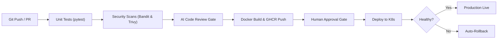
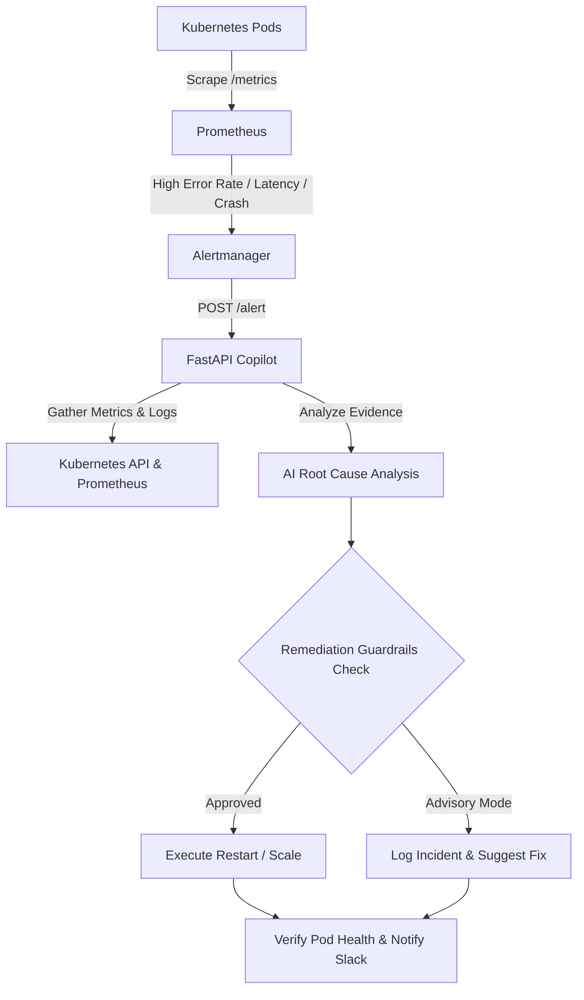
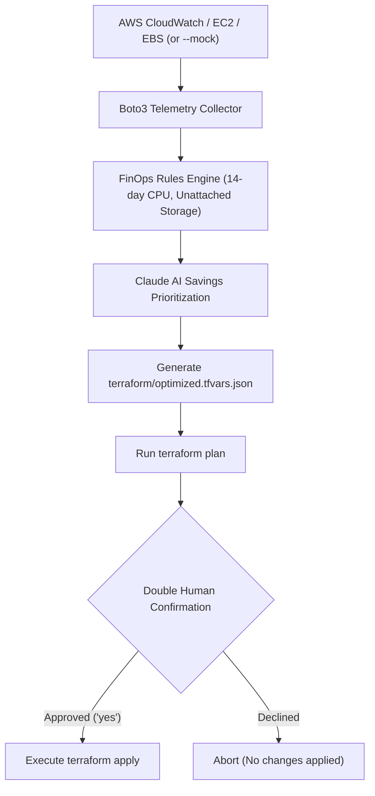

# AI DevOps Lab — 3 Production-Grade Projects

[](https://github.com/Sanket19v/devops-project/actions)


A production-grade, end-to-end DevOps lab demonstrating modern automation, DevSecOps, site reliability engineering (SRE), infrastructure as code (IaC), and practical AI integration across three standalone projects.

---

## Portfolio Projects

| # | Project Folder | Primary Skills & Tools | Highlights |
|---|---|---|---|
| **01** | [**`project-1-ai-cicd/`**](project-1-ai-cicd/) | Docker, GitHub Actions, Bandit, Trivy, Kubernetes, GHCR | Automated testing, SAST security linting, AI PR code review & risk gate, automated rollback |
| **02** | [**`project-2-incident-copilot/`**](project-2-incident-copilot/) | Kubernetes, Prometheus, Alertmanager, Helm, FastAPI, RBAC | Automated incident triage, log & metric evidence collection, LLM root-cause diagnosis, guard-railed self-healing |
| **03** | [**`project-3-cost-optimizer/`**](project-3-cost-optimizer/) | AWS (EC2/EBS/CloudWatch), Boto3, Terraform, FinOps | Telemetry-driven cloud waste detection, AI savings prioritization, automated Terraform plan generation with human approval |

> **Note:** Each folder is fully standalone with its own dedicated [README.md](project-1-ai-cicd/README.md), dependencies, source code, and tests. All three projects run completely free offline (rule-based fallback mode) without requiring paid LLM API keys.

---

## Repository Structure

```
devops-project/
├── .github/
│   └── workflows/
│       └── ci-cd.yml                # Monorepo CI/CD workflow for Project 1
│
├── project-1-ai-cicd/               # Project 1: AI-Powered CI/CD Pipeline
│   ├── app/                         # Microservice with /metrics, tests, and Dockerfile
│   ├── common/                      # Shared LLM wrapper (Claude API + rule fallback)
│   ├── k8s/                         # Kubernetes Deployment, Service, and Probes
│   ├── ai_review.py                 # AI code reviewer and release notes generator
│   ├── requirements-ai.txt          # Dependencies for AI review
│   └── README.md                    # Detailed Project 1 guide & file-by-file breakdown
│
├── project-2-incident-copilot/      # Project 2: AI Incident Copilot & Self-Healing K8s
│   ├── app/                         # Demo microservice exposing simulation endpoints
│   ├── common/                      # LLM wrapper with fallback
│   ├── k8s/                         # Manifests: ServiceMonitor, PrometheusRule, Copilot RBAC
│   ├── copilot.py                   # FastAPI Alertmanager webhook receiver & remediation engine
│   ├── Dockerfile                   # Container definition for Copilot
│   ├── helm-values.yaml             # Alertmanager webhook routing configuration
│   ├── requirements.txt             # Python dependencies
│   └── README.md                    # Detailed Project 2 guide & incident testing walkthrough
│
├── project-3-cost-optimizer/        # Project 3: AI Cloud Cost Optimizer
│   ├── common/                      # LLM wrapper with fallback
│   ├── terraform/                   # Demo AWS infrastructure (instances + orphan volumes)
│   ├── optimizer.py                 # FinOps audit, AI recommendation, and Terraform plan engine
│   ├── sample_data.json             # Mock AWS CloudWatch telemetry for 100% offline demos
│   ├── requirements.txt             # Python dependencies (boto3, anthropic)
│   └── README.md                    # Detailed Project 3 guide & FinOps workflow breakdown
│
├── ROADMAP.md                       # 10-Week DevOps learning roadmap
└── README.md                        # Portfolio overview (this file)
```

---

## Quick Tour of Each Project

### [Project 1: AI-Powered CI/CD Pipeline](project-1-ai-cicd/)



- **Core Idea**: Continuous Delivery pipeline that gates pull requests on both deterministic security checks (Bandit SAST, Trivy CVE scanning) and LLM-assisted risk analysis.
- **Key Feature**: If a Kubernetes deployment fails readiness probes within 120 seconds, it automatically executes `kubectl rollout undo` to prevent downtime.
- **Deep-Dive Guide**: See [`project-1-ai-cicd/README.md`](project-1-ai-cicd/README.md).

---

### [Project 2: AI Incident Copilot + Self-Healing Kubernetes](project-2-incident-copilot/)



- **Core Idea**: Bridges monitoring and operational action by consuming Prometheus Alertmanager alerts, querying live diagnostic data, and determining root causes in seconds.
- **Key Feature**: Built with safety guardrails—automated healing (`REMEDIATE=true`) is restricted to allowed namespaces and capped by maximum replica limits.
- **Deep-Dive Guide**: See [`project-2-incident-copilot/README.md`](project-2-incident-copilot/README.md).

---

### [Project 3: AI Cloud Cost Optimizer](project-3-cost-optimizer/)



- **Core Idea**: Audits cloud infrastructure for idle instances, over-provisioned workloads, unattached storage volumes, and stale snapshots, calculating exact estimated dollar waste.
- **Key Feature**: Modifies Terraform state dynamically and mandates a two-phase interactive human approval gate before executing any downsizing operations.
- **Deep-Dive Guide**: See [`project-3-cost-optimizer/README.md`](project-3-cost-optimizer/README.md).

---

## Recommended Learning Path

Follow the [**10-Week Roadmap**](ROADMAP.md) to progress from local containers to Kubernetes incident automation and cloud FinOps:
1. **Weeks 1–4**: Project 1 (Docker, GitHub Actions, DevSecOps, Kubernetes Deployment)
2. **Weeks 5–6**: Project 2 (Prometheus, Grafana, Alertmanager, AI Copilot, Self-Healing)
3. **Weeks 7–9**: Project 3 (AWS CloudWatch, FinOps, Terraform IaC, Automated Right-Sizing)
4. **Week 10**: Portfolio polish, demo videos, and technical writeups
