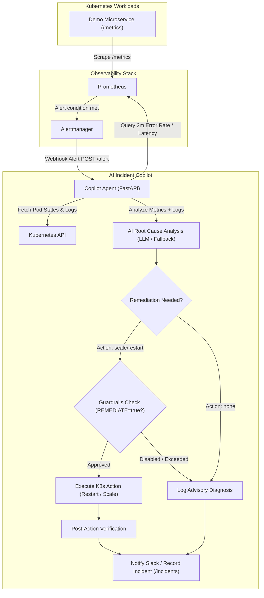

# Project 2 — AI Incident Copilot + Self-Healing Kubernetes

## What It Does

This project implements an **automated Site Reliability Engineering (SRE) copilot** that monitors Kubernetes workloads using Prometheus and Alertmanager. When an incident occurs, Alertmanager triggers the Copilot via webhook. The Copilot queries Prometheus metrics and the Kubernetes API to collect logs and pod statuses, runs AI-assisted root cause analysis, and (if enabled) triggers safe, guard-railed self-healing actions (such as pod restarts or horizontal scaling).



---

## File-by-File Breakdown

### 1. The Demo App — [`app/main.py`](app/main.py)

A **FastAPI microservice** engineered specifically to simulate real-world microservice workloads and production failures:

| Endpoint | Method | Purpose |
|----------|--------|---------|
| `/` | `GET` | Main landing endpoint returning service name and status |
| `/health` | `GET` | Liveness & readiness probe for Kubernetes |
| `/metrics` | `GET` | Exposes Prometheus telemetry (`app_requests_total`, `app_request_seconds`) |
| `/error` | `GET` | Simulates HTTP 500 internal server errors (triggers `HighErrorRate` alert) |
| `/slow` | `GET` | Injects a 2-second sleep to simulate backend degradation (triggers `HighLatency` alert) |
| `/crash` | `GET` | Forcefully terminates the process with `os._exit(1)` (triggers `PodCrashing` alert) |

---

### 2. The Copilot Agent — [`copilot.py`](copilot.py)

The core intelligent SRE agent built with FastAPI:

- **Webhook Ingestion (`POST /alert`)**: Receives JSON alert payloads from Prometheus Alertmanager.
- **Evidence Gathering (`gather()`)**:
  - Automatically queries Prometheus for error rates (`sum(rate(app_requests_total{status="500"}[2m]))`), p95 latencies, and restart counts over the last hour.
  - Queries the Kubernetes CoreV1 API for container statuses, exit codes, termination reasons (e.g. `OOMKilled`, `Error`), and the last 100 lines of container logs.
- **AI Root Cause Analysis**: Sends formatted telemetry to Claude via `common/llm.py` requesting a structured diagnosis (root cause, confidence level, suggested fix, recommended action). If no API key is provided, it automatically applies rule-based heuristic pattern matching.
- **Guard-Railed Self-Healing (`remediate()`)**:
  - Restarts crashing deployments by updating the `kubectl.kubernetes.io/restartedAt` annotation.
  - Scales under-provisioned deployments up to a strict configurable limit (`MAX_REPLICAS`, default: 4).
  - Only executes if `REMEDIATE=true` and targeted namespace is in `ALLOWED_NAMESPACES`.
- **Verification & Notification**: Checks if pods become healthy following remediation, stores incident history in memory (`GET /incidents`), and posts incident summaries to Slack if a webhook is configured.

---

### 3. Demo App Kubernetes Manifest — [`k8s/app.yaml`](k8s/app.yaml)

Defines the target application deployment and monitoring rules:
- **Deployment**: 2 replicas of `demo-app` with CPU/Memory limits, readiness and liveness probes.
- **Service**: Exposes port 8000 for internal cluster routing.
- **ServiceMonitor**: Directs the Prometheus Operator to scrape `/metrics` every 15 seconds.
- **PrometheusRule**: Custom alerting rules:
  - `HighErrorRate`: Triggers when 500 error rate exceeds 5% for 1 minute.
  - `HighLatency`: Triggers when 95th percentile latency exceeds 1s for 2 minutes.
  - `PodCrashing`: Triggers when pod restart count increases over 5 minutes.

---

### 4. Copilot Kubernetes Manifest — [`k8s/copilot.yaml`](k8s/copilot.yaml)

Configures the Copilot inside Kubernetes:
- **ServiceAccount & ClusterRole**: Least-privilege RBAC granting read-only access to pods and logs, and `patch` access restricted specifically to Deployments.
- **Deployment**: Runs `copilot.py` on port 8000 with environment variables for Prometheus URL, safety limits, and optional API keys.
- **Service**: Internal service (`copilot.default.svc:8000`) enabling Alertmanager to route alert webhooks to the copilot.

---

### 5. Alertmanager Configuration — [`helm-values.yaml`](helm-values.yaml)

Custom configuration overrides for the `kube-prometheus-stack` Helm chart:
- Configures Alertmanager routing trees.
- Registers a `webhook_configs` receiver pointing directly to `http://copilot.default.svc:8000/alert`.

---

### 6. LLM Helper — [`common/llm.py`](common/llm.py)

Wrapper providing AI inference with automatic fallback:
- `ask_json(system, prompt)`: Calls Anthropic Claude and parses JSON output.
- **Fallback Guarantee**: If no API key is provided, returns `None` so `copilot.py` executes rule-based incident diagnosis without crashing.

---

## Skills You Learn

| Skill | Where You See It |
|-------|------------------|
| **Kubernetes (K8s)** | Deployments, Services, ServiceMonitors, RBAC security |
| **Prometheus & Alertmanager** | PromQL metrics, custom alerting rules, alert routing |
| **Helm** | Customizing complex production charts (`kube-prometheus-stack`) |
| **SRE & Incident Response** | Automated triage, evidence collection, log diagnosis |
| **Safe AI Remediation** | Guardrails (replica caps, namespace isolation, human approval gates) |
| **FastAPI** | Asynchronous webhook ingestion and background tasks |

---

## Key Design Decisions & Guardrails

1. **Safety First (Remediation is OFF by default)**: `REMEDIATE="false"` by default. The copilot operates in advisory mode until you explicitly enable automated healing.
2. **Strict Blast Radius Containment**: The copilot can only modify workloads in namespaces explicitly listed in `ALLOWED_NAMESPACES` (default: `default`).
3. **Hard Ceiling on Scaling**: Horizontal scaling is restricted to `MAX_REPLICAS` (default: 4) to prevent runaway cloud costs.
4. **Post-Action Verification**: The copilot monitors the workload after applying an action to confirm recovery.

---

## Quickstart & Incident Testing

### Step 1: Create Cluster & Deploy
```bash
# 1. Create a local Kind cluster
kind create cluster --name devops-lab

# 2. Build local container images
docker build -t demo-app:local app
docker build -t copilot:local .

# 3. Load images into Kind
kind load docker-image demo-app:local --name devops-lab
kind load docker-image copilot:local --name devops-lab

# 4. Install Prometheus Stack via Helm
helm repo add prometheus-community https://prometheus-community.github.io/helm-charts
helm repo update
helm install monitoring prometheus-community/kube-prometheus-stack -f helm-values.yaml

# 5. Deploy App and Copilot
kubectl apply -f k8s/app.yaml
kubectl apply -f k8s/copilot.yaml
```

### Step 2: Trigger Incidents
```bash
# Forward port for demo app
kubectl port-forward svc/demo-app 8080:80

# In another terminal, simulate 500 errors to fire HighErrorRate alert:
for ($i=1; $i -le 200; $i++) { curl -s http://localhost:8080/error > $null; Start-Sleep -Milliseconds 200 }

# Or simulate a crash:
curl http://localhost:8080/crash
```

### Step 3: View Copilot Diagnoses
```bash
# Stream live diagnosis
kubectl logs deploy/copilot -f

# Or query the API
kubectl port-forward svc/copilot 8000:8000
curl http://localhost:8000/incidents
```
