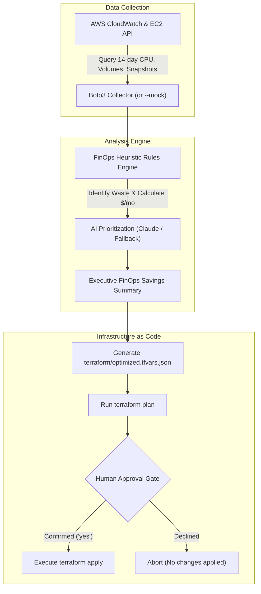

# Project 3 — AI Cloud Cost Optimizer

## What It Does

This project implements an **automated Cloud FinOps assistant** that continuously audits AWS infrastructure (EC2 compute instances, unattached EBS storage volumes, and stale snapshots), calculates financial waste based on historical CloudWatch telemetry, leverages an AI model to prioritize actionable savings, generates Terraform variable overrides (`optimized.tfvars.json`), and requires **two explicit human approval confirmations** before safely applying changes via Terraform.



---

## File-by-File Breakdown

### 1. The FinOps Engine — [`optimizer.py`](optimizer.py)

The core automation script providing an end-to-end audit, recommendation, and execution pipeline:

- **Data Collection (`collect_aws(region)`)**:
  - Connects to AWS EC2 and CloudWatch via `boto3`.
  - Analyzes **14 days of CPU utilization history** (`Average` and `Maximum` percent) for running instances.
  - Queries EBS volumes with status `available` (unattached/orphan volumes incurring daily storage charges).
  - Identifies EBS snapshots created by the account that are older than 90 days.
- **Waste Identification Engine (`analyse(data)`)**:
  - Evaluates instances against pricing formulas (e.g. `t3.nano` to `t3.2xlarge`).
  - Categorizes waste and calculates exact dollar savings per month.
- **AI Prioritization (`common/llm.py`)**:
  - Prompts Claude to synthesize technical findings into an executive-level FinOps recommendation report.
  - If no API key is set, automatically generates a clean structured summary from rule output.
- **IaC Code Modification (`write_tfvars()`)**:
  - Exports proposed changes directly into `terraform/optimized.tfvars.json`.
- **Safe Execution (`plan_apply()`)**:
  - Runs `terraform plan -var-file=optimized.tfvars.json`.
  - Displays the plan diff to the engineer and enforces a double human confirmation prompt before executing `terraform apply`.

---

### 2. Demo Infrastructure — [`terraform/main.tf`](terraform/main.tf)

Defines a reproducible AWS sandbox designed to test waste detection:
- **`variable "instances"`**: Map of compute instances (`web-1: t3.small`, `batch-1: t3.micro`). When `optimized.tfvars.json` is generated, this variable is overridden with downsized or decommissioned specifications.
- **`resource "aws_instance" "this"`**: Deploys lightweight Amazon Linux 2023 instances.
- **`resource "aws_ebs_volume" "orphan"`**: Intentionally provisions an unattached 10GB `gp3` storage volume to test orphan volume detection.

---

### 3. Mock Telemetry Dataset — [`sample_data.json`](sample_data.json)

Enables **100% offline testing without an AWS account or cloud expenses**:
- Simulates an idle `t3.large` instance (0.8% average CPU).
- Simulates an over-provisioned `t3.medium` instance (12.4% average CPU).
- Simulates an unattached 100GB EBS volume.
- Simulates a 50GB stale snapshot (120 days old).

---

### 4. LLM Wrapper — [`common/llm.py`](common/llm.py)

Thin client for Anthropic Claude:
- Generates natural language summaries of complex infrastructure waste.
- **Zero-Failure Fallback**: Returns `None` if `ANTHROPIC_API_KEY` is not present, allowing `optimizer.py` to seamlessly fall back to deterministic rule-based output.

---

## How It Identifies Waste

| Waste Category | Detection Threshold | Action Recommended | Estimated Savings Formula |
|---|---|---|---|
| **Idle Instance** | Avg CPU < 5% AND Max CPU < 20% over 14 days | Stop or Terminate | 100% of instance monthly cost |
| **Over-provisioned Instance** | Avg CPU < 20% AND Max CPU < 60% over 14 days | Right-size (Downsize 1 tier) | Difference in hourly rate × 730 hrs |
| **Orphan Volume** | EBS Volume in `available` state (unattached) | Create Snapshot then Delete | $0.08 / GB-month (`gp3`) |
| **Stale Snapshot** | EBS Snapshot age > 90 days | Archive to S3 Glacier or Delete | $0.05 / GB-month |

---

## Skills You Learn

| Skill | Where You See It |
|-------|------------------|
| **AWS Cloud Architecture** | EC2 sizing, EBS lifecycle, CloudWatch metric statistics |
| **Boto3 SDK** | Programmatic infrastructure inspection and telemetry extraction |
| **FinOps Principles** | Idle detection, right-sizing computation, storage reclamation |
| **Terraform IaC** | Dynamic variable files (`.tfvars`), automated diff generation, plan validation |
| **Safe AI DevOps** | Guard-railed execution, strict human-in-the-loop approval gates |

---

## Key Design Decisions & Guardrails

1. **Read-Only by Default**: Running `python optimizer.py --region <region>` performs only `Describe*` and `GetMetricStatistics` calls. It cannot modify or destroy infrastructure.
2. **Two-Phase Human Confirmation**: Applying changes (`--apply`) requires explicit confirmation ("Type 'yes' to proceed") after the engineer reviews the exact `terraform plan` output.
3. **Reproducible Mock Mode**: Engineers can run, test, and demo the entire AI workflow offline with `--mock` without incurring cloud bills.

---

## Quickstart Guide

### 1. Test in Mock Mode (No AWS Required)

```bash
# Install dependencies
pip install -r requirements.txt

# Run full audit and AI prioritization against mock data
python optimizer.py --mock
```

### 2. Run Against Real AWS

```bash
# 1. Configure AWS credentials (requires read access to EC2 & CloudWatch)
aws configure

# 2. Deploy demo infrastructure
terraform -chdir=terraform init
terraform -chdir=terraform apply

# 3. Run cost audit (read-only)
python optimizer.py --region us-east-1

# 4. Review plan and apply optimized sizing
python optimizer.py --apply

# 5. Clean up when finished testing
terraform -chdir=terraform destroy
```
